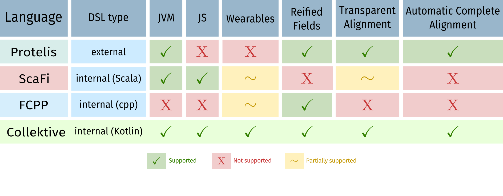
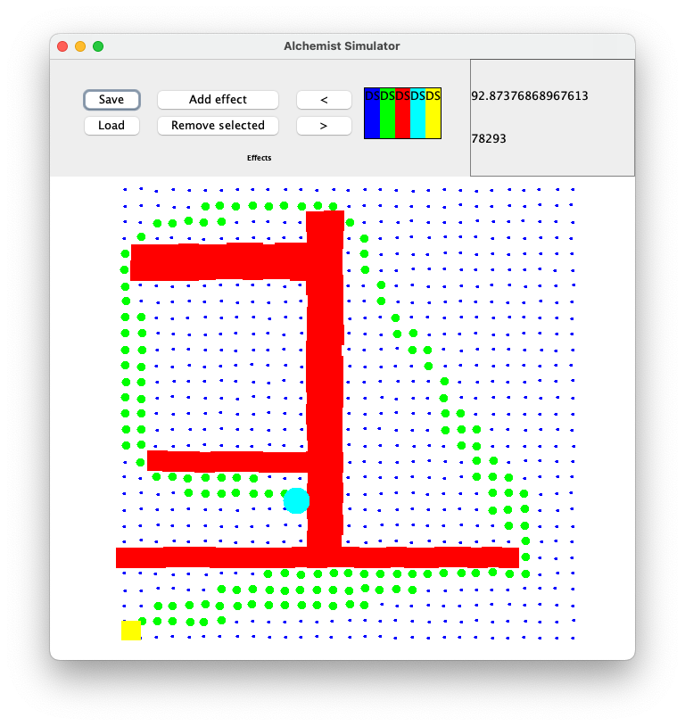
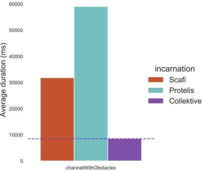

+++

title = "Improving the Simulation Performance for Aggregate Programs Through Compiler Plugins"
description = "DS-RT 2024 PhD Symposium presentation"
outputs = ["Reveal"]

+++

# Improving the Simulation Performance for <span class="fragment custom red" data-fragment-index="0">Aggregate Programs</span> Through Compiler Plugins

<p class="fragment fade-out" data-fragment-index="0">
<a href="mailto:angela.cortecchia@unibo.it"><b>Angela Cortecchia</b></a></br>
GARR research fellow & (soon) PhD Student @UniBo</br>


</p>

---

# What is Aggregate Computing<small>[1]</small>?


A macro-programming approach that defines the **collective behavior** of a heterogeneous set of devices in a **self-organizing system**.
<!-- Based on the **Field Calculus**<small>[2]</small>, operates by manipulating distributed data structures called *fields*. -->

Devices self-organize exchanging messages, abstracting from the communication approach thanks to **alignment**.

Based on the **Field Calculus**<small>[2]</small>, operates by manipulating distributed data structures called *fields*.

<div>
<small style="text-align: left">
[1] Beal, J., Pianini, D., Viroli, M. "Aggregate Programming for the Internet of Things." 2015.</br>
[2] Audrito, G., Viroli, M., Damiani, F., Pianini, D., Beal, J. "A Higher-Order Calculus of Computational Fields." 2019.
</small>
</div>

---

# Alignment<small>[3]</small>


Devices within the system that execute the same part of the Abstract Syntax Tree are **aligned** and capable of communication.

<div>
<small style="text-align: left;">
[3] G. Audrito, M. Viroli, F. Damiani, D. Pianini and J. Beal, “A Higher-Order Calculus of Computational Fields”
</small>
</div>

---

# Improving the **Simulation Performance** for Aggregate Programs Through Compiler Plugins

---

# Simulating _Aggregate Computing_ systems

{}

{}
Simulations are part of the **development cycle**.




{}

{}

{}

{}


---

# Low level language: _FCPP_ <small>[4]</small>

{}

{}
Made for low-consumption devices.
Expected to be fast in simulations.

<div class="fragment">
<em>FCPP limitations</em>: 
<ul>
  <li><strong>Non-friendly</strong> language;</li>
  <li>Aggregate <strong>base-mechanism not hidden</strong>.</li>
</ul>
</div>
{}
{}

For example


<!-- ```cpp
//manual alignment
field<double> f = nbr(CALL, 4.2);
int n = nbr(CALL, 0, [&](field<int> a){
    return min_hood(CALL, a)
});
``` -->
{}

{}

<div>
<small style="text-align: left;">
[4] G. Audrito, and G. Torta, "FCPP to aggregate them all."
</small>
</div>

---

# Alternatives?



<!-- - Create a new language: **external DSL** -->
<!-- or -->
<!-- - **Hide** the **alignment** at runtime with **internal DSL** -->

---

# Domain Specific Language (DSL)

{}

{}
## External DSL

<ul class="fragment">
  <li>Self-contained language with <strong>custom syntax and semantics</strong>;</li>
  <li>Can be tailored to <strong>specific performance</strong> or <strong>scalability requirements</strong>;</li>
  <li><strong>Harder to integrate</strong> with existing systems (needs custom tooling);</li>
  <li><strong>Tougher</strong> learning curve.</li>
</ul>
{}

{}
### or
{}

{}
## Internal DSL

<ul class="fragment">
  <li>Built on top of a <strong>host language</strong>;</li>
  <li>Takes <strong>advantage</strong> of its <strong>features</strong>, <strong>tools</strong>, and <strong>ecosystem</strong>.</li>
  <li><strong>Reduced</strong> learning curve.</li>
  <li><strong>Performances</strong> tied to the <strong>host language</strong>.</li>
</ul>
{}

{}

---

# External DSL: _Protelis_ <small>[5]</small>

Java-like **standalone language**.

Hides main aggregate computing mechanisms, such as alignment.

<div class="fragment">
<em>But</em>
<!-- - being a standalone language, its interpreter and compiler are not ma -->
<b>slower in complex programs</b>, due to its compiler.
</div>

<br><br>

<div>
<small style="text-align: left;">
[5] D. Pianini, M. Viroli, and J. Beal, “Protelis: practical aggregate programming”
</small>
</div>

---

# Internal DSL: _ScaFi_ <small>[6]</small>

{}

{}

Scala-based internal DSL.

Alignment **hidden at runtime** doing stack investigation.

<div class="fragment">
<em>ScaFi limitations</em>:
<ul>
  <li>base aggregate operations must be done inside specific contexts;</li>
  <!-- <li>still some limitations at alignment and language-level;</li> -->
  <li>not very performant, due to runtime alignment via stack inspection.</li>
</ul>
</div>
{}

{}

For example 


{}


{}


<div>
<small style="text-align: left;">
[6] R. Casadei, M. Viroli, G. Aguzzi, and D. Pianini, “Scafi: A scala DSL and toolkit for aggregate programming”
</small>
</div>

---

# Improving the Simulation Performance for Aggregate Programs Through **Compiler Plugins**



---

# Idea: use a _Compiler Plugin_

Annotates the aggregate program on a stack at **compile time**.

Devices with the **same annotations in the stack** are "aligned" and can communicate.

<div class="fragment">
<em>Pros</em>:<br>
<ul>
  <li>Expressivity untouched;</li>
  <li>No overhead of the classic approaches.</li>
</ul>
<div>

---

# Meet **Collektive**

{}

{}

{}

{}
- Internal DSL in Kotlin Multiplatform;
- **Alignment** made automatically **behind the scene** through compiler plugin.
- **Linked to** the general purpose **_Alchemist_** <small>[7]</small> **simulator**, which can execute also _Protelis_ and _ScaFi_ programs.

First implementation of the prototype DSL used to develop experiments related to the morphogenesis of plants<small>[8]</small>.

{}

{}

<div>
<small style="text-align: left">
[7] D. Pianini, S. Montagna, and M. Viroli, “Chemical-oriented simulation of computational systems with ALCHEMIST”;</br>
[8] A. Cortecchia, D. Pianini, G. Ciatto, and R. Casadei, "An Aggregate Vascular Morphogenesis Controller for Engingeered Self-Organising Spatial Structures".
</div>
</small>

---

# **Improving** the Simulation **Performance** for Aggregate Programs Through Compiler Plugins

---

{}

{}
## Reference scenario

_Channel with obstacles_ <small>[8]</small>:</br>
an algorithm to build a **redundant channel between two points** in a meshed network,
avoiding obstacles and adapting to topology changes.

<iframe class="fragment" width="70%" height=70%" loading="eager" autoplay="true" src="images/channel.mp4" ></iframe>

<!--  -->
<!--  -->
{}

{}
<div class="fragment">
<h2>Results</h2>
<ul>
  <li>External DSLs (<em>Protelis</em>) has performance disadvantages in complex programs, respect to internal DSLs (<em>Collektive</em> & <em>ScaFi</em>);</li>
  <li><strong>Compiler plugin optimizes performance</strong> between internal DSLs, thanks to the management of the alignment.</li>
</ul>

</div>

<!-- <div class="r-stack">
  
  
</div> -->
{}

{}

<div>
<small style="text-align: left"><br><br>
[8] R. Casadei, G. Fortino, D. Pianini, A. Placuzzi, C. Savaglio, and M. Viroli, “A methodology and simulation-based toolchain for estimating deployment performance of smart collective services at the edge"
</small>
</div>

---

# Conclusion

{}

{}
This work demonstrates that the **technology used within a tool affects program execution time**.

<div class="fragment">
<h3>Future works</h3>

<ul>
  <li><strong>Further enhancing</strong> for efficient and faster execution across various platforms;</li>
  <li>Create a <strong>standard library</strong> of aggregate building blocks;</li>
  <li>Exploit the tool to the concept of "<strong>collective operating systems</strong>".</li>
</ul>
</div>

{}

{}

<div style="text-align: center;">
<p><i class="fab fa-github mr-3" style="color: #095aa6;"></i> <a href="https://github.com/Collektive/collektive">Collektive</a></p>
</div>
{}

{}


<!-- [Collektive](https://github.com/Collektive/collektive) -->